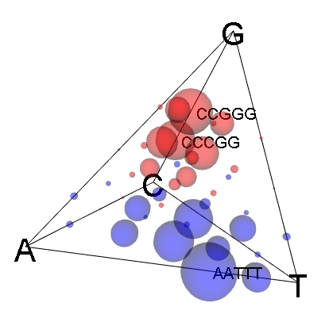

# kmerPyramid

R package to visualize the acgt or k-mer distribution between samples.

## Table of Contents
1. [Installation](#installation)
2. [Examples](#examples)
3. [Tutorial](#tutorial)

<p align="center">
  
  
</p>

## Installation

# Dependencies

```R
source("http://bioconductor.org/biocLite.R")
biocLite("ShortRead")
```
Get the released version from CRAN:

```R
## not available yet
## install.packages("kmerPyramid")
```

Or the development version from github:

```R
# install.packages("devtools")
devtools::install_github("jkruppa/kmerPyramid")
```

## Examples

### acgt pyramid 3D

```R
library(kmerPyramid)

data(viralExampleSeqs)
 
kmer_distr <- get_kmer_distribution(viralExampleSeqs, k = 1)
 
pyramid_3d(kmer_distr,
           cex = 2,
           color = "blue")
 
ids <- names(viralExampleSeqs)
 
pyramid_3d(kmer_distr,
           ids = ids,
           cex = 2,
           color = "blue",
           identify = TRUE)
 
data(viralExampleCodingSeq)
 
kmer_distr <- get_kmer_distribution(viralExampleCodingSeq, k = 1)
text_ids <- ifelse(names(viralExampleCodingSeq) == "non_coding", "x", "o")
color_ids <- ifelse(names(viralExampleCodingSeq) == "non_coding", "black", "red")
 
pyramid_3d(kmer_distr,
           cex = 1,
           text = text_ids,
           color = color_ids)
 
ids <- names(viralExampleCodingSeq)

pyramid_3d(kmer_distr,
           ids = ids,
           cex = 1,
           text = text_ids,
           color = color_ids,
           identify = TRUE)
```

<p align="center">
  
</p>

### k-mer pyramid 3D with sliding window

```R
library(kmerPyramid)

data(viralExampleSeqs)

viral_window_list <- get_pca_window_list(viralExampleSeqs, window = 5)

pyramid_3d_grid(viral_window_list[1],
                color = "red")
```
<p align="center">
  
</p>

```R
pyramid_3d_grid(viral_window_list[1],
                color = "red",
                identify = TRUE)
```
<p align="center">
  
</p>

```R
pyramid_3d_grid(viral_window_list[c(3,5)],
                difference = TRUE)
```
<p align="center">
  
</p>

```R
pyramid_3d_grid(viral_window_list[c(3,5)],
                difference = TRUE,
                identify = TRUE)
```
<p align="center">
  
</p>

```R
pyramid_3d_grid(viral_window_list[c(3,5)],
                difference = TRUE,
                bw = TRUE,
                bw.cex = 75,
                identify = TRUE)
```

<p align="center">
  
</p>

## Tutorial

**This ia a R package**. If you have never ever worked with R or a programing language, feel free to visit http://tryr.codeschool.com/ a free online school on R syntax and programing. This will give you a deeper insight than this tutorial is planed for. 

The installation is very simple. Start R and copy and paste the following code. This will install `devtools` which is needed to install packages from this GitHub repository. In the next line the kmerPyramid package will be installed. This has only be done once, after installing use `library(kmerPyramid)` to load the package.

```R
install.packages("devtools")
devtools::install_github("jkruppa/kmerPyramid")
```

We obtain a single random fasta file with three virus sequences under `/data/virus.fa`. This file can be directly loaded into R by using the package Biostrings. The package should be installed automatically by the kmerPyramid package. If not please follow the instructions under https://bioconductor.org/packages/release/bioc/html/Biostrings.html. 

```R
library(Biostrings)
sequence <- readDNAStringSet("https://raw.githubusercontent.com/jkruppa/kmerPyramid/master/data/virus.fa")
```

The following shows the three virus sequences in a DNAStringSet object. The sequences have different lengths and different ACGT contents. For a deeper understanding of the DNAStringSet objects please vists the site https://web.stanford.edu/class/bios221/labs/biostrings/lab_1_biostrings.html. To select single sequences use `sequence[1]` for the first sequence and `names(sequence)` to access the names.

```
R> sequence
  A DNAStringSet instance of length 3
    width seq                                               names               
[1] 10000 CAAATTAAATTCTAAATGTTGAA...CTAGGTCTAATAAAGAATCATTA virus_1
[2]  8000 CCGCCCCGAGGCCGCGCGTGCTC...CGCCCCGCGCCCCGCGCGCCCGG virus_2
[3]  6000 GTAAAATGAGAAAAAAAAACCGA...GAGAGTCAGAAAAAAAGAGAAAC virus_3
```
It is also possible to read in own fasta files using the path to the single file in `readDNAStringSet()`

```R
library(Biostrings)
sequence <- readDNAStringSet("C:/path/to/my/fasta/my_fasta_file.txt")
```

If you have two files and would like to merge them into one single `DNAStringSet` do the following and go on with `sequence`.

```R
sequence_1 <- readDNAStringSet("C:/path/to/my/fasta/my_fasta_file_sequence_1.txt")
sequence_2 <- readDNAStringSet("C:/path/to/my/fasta/my_fasta_file_sequence_2.txt")

sequence <- c(sequence_1, sequence_2)
```
Now you can compare single sequences with each other.

### Compare two sequences

Very often you might want to compare two sequences given their k-mer distribution. In the first step the sequences must be processed by the function `get_pca_window_list()`, where the k-mer disribution of the given window size is computed. **As a rule of thumb, the differences between species start at the 5-mer distribution**. Therefore, it might be feasible to use a window size of 5. 

```R
library(kmerPyramid)

## We produce the 5-mer distribution 
viral_window_list <- get_pca_window_list(sequence, window = 5)

## We compare the sequence 1 to 2
pyramid_3d_grid(viral_window_list[c(1, 2)],
                difference = TRUE,
                identify = TRUE)       
```
The following plot will be openend and can be moved by the mouse. The window might a little bit small, so pull it larger.

<p align="center">
  
</p>

If you klick with the **right** mouse button on different bubbles you get the assigned k-mer. Like *CCGGG*, *CCCGG*, and *AATTT* in the example picture. It is always sequence 1 minus sequence 2. Blue means an increase and red means a decrease of the given k-mer. 


