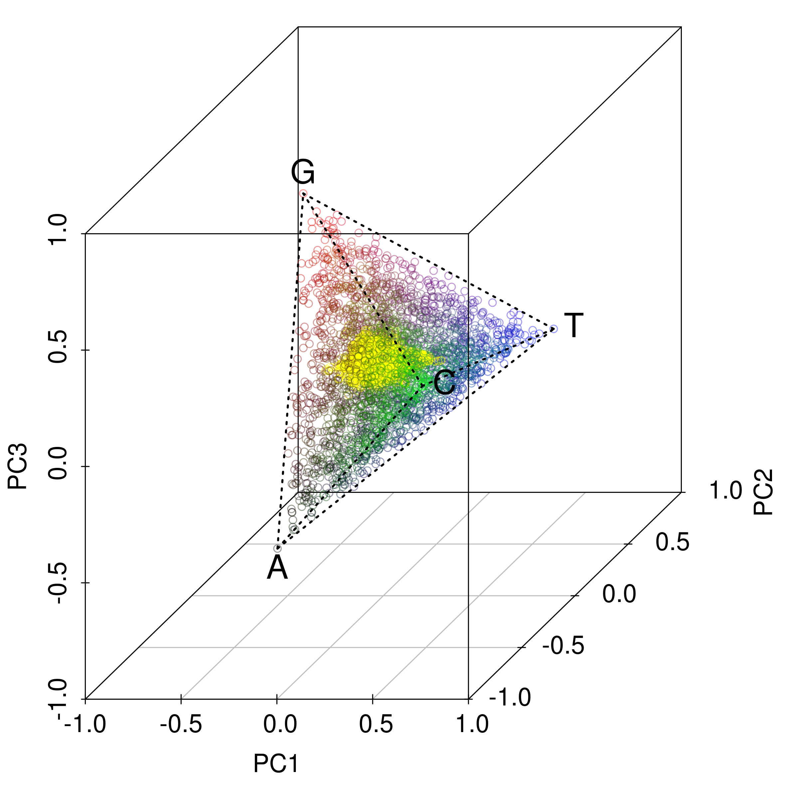
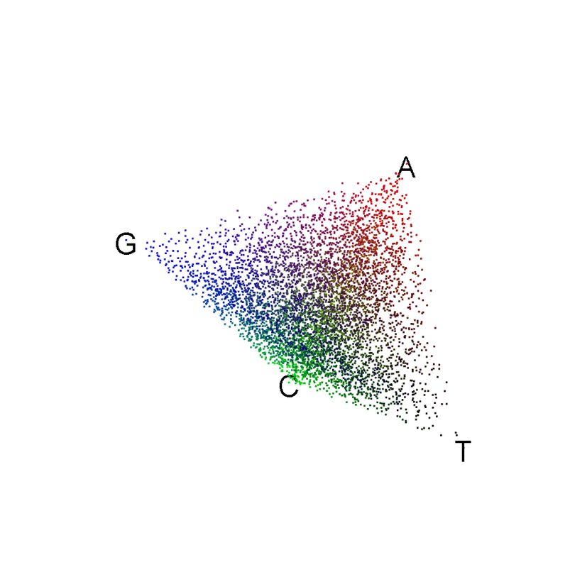
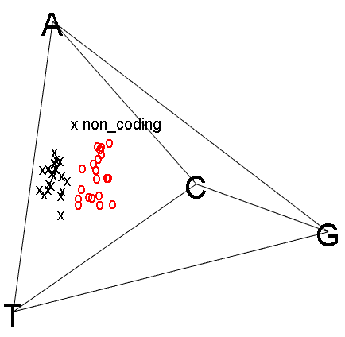
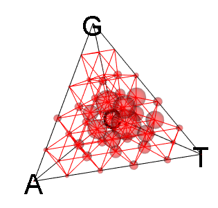
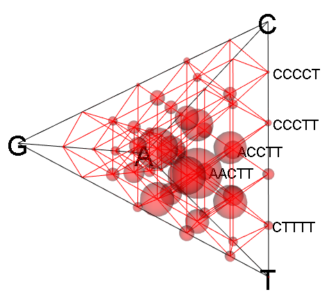
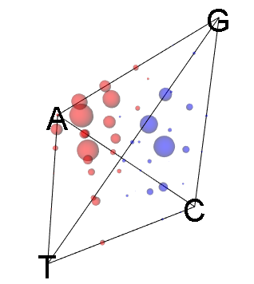
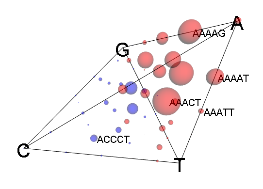
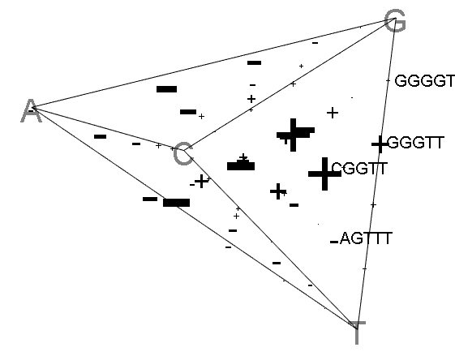

# Table of Contents
1. [Installation](#Installation)
2. [Example2](#example2)
3. [Third Example](#third-example)

## Example
## Example2
## Third Example


# kmerPyramid

R package to visualize the acgt or k-mer distribution between samples

<p align="center">
  
  
</p>


## Installation

Get the released version from CRAN:

```R
## not available yet
## install.packages("acgtPyramid")
```

Or the development version from github:

```R
# install.packages("devtools")
devtools::install_github("jkruppa/acgtPyramid")
```

## Examples

### acgt pyramid 3D

```R
library(kmerPyramid)

data(viralExampleSeqs)
 
kmer_distr <- get_kmer_distribution(viralExampleSeqs, k = 1)
 
pyramid_3d(kmer_distr,
           cex = 2,
           color = "blue")
 
ids <- names(viralExampleSeqs)
 
pyramid_3d(kmer_distr,
           ids = ids,
           cex = 2,
           color = "blue",
           identify = TRUE)
 
data(viralExampleCodingSeq)
 
kmer_distr <- get_kmer_distribution(viralExampleCodingSeq, k = 1)
text_ids <- ifelse(names(viralExampleCodingSeq) == "non_coding", "x", "o")
color_ids <- ifelse(names(viralExampleCodingSeq) == "non_coding", "black", "red")
 
pyramid_3d(kmer_distr,
           cex = 1,
           text = text_ids,
           color = color_ids)
 
ids <- names(viralExampleCodingSeq)

pyramid_3d(kmer_distr,
           ids = ids,
           cex = 1,
           text = text_ids,
           color = color_ids,
           identify = TRUE)
```

<p align="center">
  
</p>

### k-mer pyramid 3D with sliding window

```R
library(kmerPyramid)

data(viralExampleSeqs)

viral_window_list <- get_pca_window_list(viralExampleSeqs, window = 2)

pyramid_3d_window(viral_window_list[1],
                  color = "red")
```
<p align="center">
  
</p>

```R
pyramid_3d_window(viral_window_list[1],
                  color = "red",
                  identify = TRUE)
```
<p align="center">
  
</p>

```R
pyramid_3d_window(viral_window_list[c(3,5)],
                  difference = TRUE)
```
<p align="center">
  
</p>

```R
pyramid_3d_window(viral_window_list[c(3,5)],
                  difference = TRUE,
                  identify = TRUE)
```
<p align="center">
  
</p>

```R
pyramid_3d_window(viral_window_list[c(3,5)],
                  difference = TRUE,
                  bw = TRUE,
                  bw.cex = 75,
                  identify = TRUE)
```

<p align="center">
  
</p>
